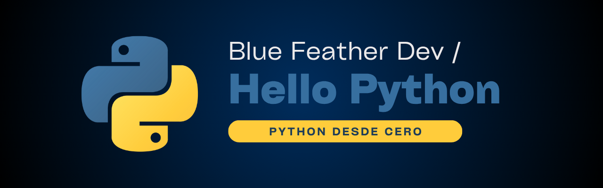

# Hello, Python!

 

 
Este repositorio es mi espacio de estudio personal para **practicar Python a fondo**, con ejemplos, ejercicios del curso de W3Schools 2024 y proyectos académicos.

## 🔎 ¿Qué encontrarás aquí?

- **Aprendizaje estructurado**: folder organizado por tema y librería

- **Pruebas personales**: experimentos propios y notas sobre comportamiento de código
- **Retos y prácticas**: ejercicios del curso W3Schools y otros desafíos opcionales

## 🗂️ Estructura del repositorio
- `cuc/`: Código y proyectos realizados en la Corporación Universidad de la Costa

- `w3schools/`: Scripts del curso oficial W3Schools Python 2024. Sintaxis y estructuras esenciales
- `numpy/`, `pandas/`: Operaciones y análisis de datos
- `tkinter/`: Ejemplos de interfaces gráficas con GUI nativo
- `turtle/`: Ejercicios gráficos y educativos con Turtle

## 🎯 Objetivos del repositorio

- Reforzar mi conocimiento de Python desde cero

- Aprender a usar librerías populares como `tkinter`, `turtle`, `numpy` y `pandas`
- Documentar progresos y descubrimientos de forma ordenada

> Made with '\u{2665}' (♥)
